# Scanner Sequence Diagram

```mermaid
sequenceDiagram
    participant Cron as Cron / Manual Trigger
    participant Full as runFullScan()
    participant DB as PostgreSQL
    participant Scan as scanTicker()
    participant API as FinancialData.net API
    participant BS as Black-Scholes

    Cron->>Full: Start scan for userId

    %% ── Initialization ──────────────────────────────────────
    Full->>DB: SELECT watchlistTickers WHERE userId
    DB-->>Full: [AAPL, MSFT, GOOG, ...]
    Full->>DB: DELETE scanResults WHERE userId (clear previous run)

    loop For each ticker (sequential, rate-limited)
        Full->>Scan: scanTicker(ticker, userId)

        %% ── PHASE 1: Stock Universe Filter ──────────────────
        note over Scan: Phase 1: Stock Universe Filter

        Scan->>API: GET /api/v1/stock-prices?identifier={ticker}
        API-->>Scan: ~200 daily OHLCV records

        alt API call fails
            Scan-->>Full: FAIL Phase 1 (fetch error)
        end

        note over Scan,DB: Persist 60 most recent records for charts
        Scan->>DB: DELETE historicalStockPrice WHERE ticker
        Scan->>DB: INSERT 60 OHLCV records (createMany)

        note over Scan: Compute metrics from price records
        Scan->>Scan: Sort records by date descending
        Scan->>Scan: stockPrice = most recent close
        Scan->>Scan: computeSMA(closes, 200) -> sma200
        Scan->>Scan: computeSMA(closes, 50) -> sma50
        Scan->>Scan: avgVolume = mean of last 20 daily volumes
        Scan->>Scan: SMA trend = compare sma200 now vs 20 days ago

        note over Scan: Apply Phase 1 filters
        Scan->>Scan: Check: $13 <= stockPrice <= $150
        Scan->>Scan: Check: avgVolume >= 1,000,000
        Scan->>Scan: Check: sufficient data for 200-day SMA
        Scan->>Scan: Check: stockPrice > sma200
        Scan->>Scan: Check: sma200 trend is not falling

        alt Any Phase 1 check fails
            Scan-->>Full: FAIL Phase 1 (reason string)
        end

        %% ── PHASE 2: IV Screen ──────────────────────────────
        note over Scan: Phase 2: IV Screen

        Scan->>API: GET /api/v1/option-chain?identifier={ticker} (paginated, 300/page)
        API-->>Scan: All option contracts (puts + calls)

        alt API call fails or empty
            Scan-->>Full: FAIL Phase 2 (fetch error)
        end

        note over Scan: Filter chain to OTM puts
        Scan->>Scan: Keep contracts where type=Put AND strike <= stockPrice
        Scan->>Scan: Find ATM put (strike closest to stockPrice)

        par Fetch ATM put data (parallel)
            Scan->>API: GET /api/v1/option-greeks?identifier={atmPut}
            API-->>Scan: Historical greeks for ATM put
        and
            Scan->>API: GET /api/v1/option-prices?identifier={atmPut}
            API-->>Scan: Historical OHLCV for ATM put
        end

        alt Either fetch fails
            Scan-->>Full: FAIL Phase 2 (fetch error)
        end

        note over Scan,BS: Compute IV from option prices via Black-Scholes
        Scan->>Scan: Build stockPriceByDate lookup from Phase 1 data

        loop For each ATM option price record
            Scan->>Scan: Look up stock close price on same date
            Scan->>Scan: Compute DTE from option expiration to price date
            Scan->>BS: computeIV(optionClose, stockClose, strike, T, riskFreeRate)
            BS-->>Scan: impliedVolatility (or null)
            Scan->>Scan: Collect { date, iv } data point
        end

        note over Scan: Compute IV rank from IV history
        Scan->>Scan: currentIV = most recent IV data point
        Scan->>Scan: ivHigh52w = max(all IV values)
        Scan->>Scan: ivLow52w = min(all IV values)
        Scan->>Scan: ivRank = (currentIV - ivLow52w) / (ivHigh52w - ivLow52w) * 100

        Scan->>Scan: Check: ivRank >= 20

        alt IV Rank too low
            Scan-->>Full: FAIL Phase 2 (iv_rank_too_low)
        end

        %% ── PHASE 3: Option Selection ───────────────────────
        note over Scan: Phase 3: Option Selection

        Scan->>Scan: Filter OTM puts to DTE window (5-45 days)

        loop For each candidate put contract in DTE window
            par Fetch contract data (parallel)
                Scan->>API: GET /api/v1/option-greeks?identifier={contract}
                API-->>Scan: Greeks history (delta, gamma, theta, vega, rho)
            and
                Scan->>API: GET /api/v1/option-prices?identifier={contract}
                API-->>Scan: Price history (OHLCV, volume, openInterest)
            end

            note over Scan: Assemble contract data
            Scan->>Scan: Take most recent greeks record (latest delta, theta, etc.)
            Scan->>Scan: Take most recent price record (latest close as bid proxy)

            note over Scan,BS: Compute per-contract IV
            Scan->>BS: computeIV(optionClose, stockPrice, strike, T, riskFreeRate)
            BS-->>Scan: contractIV
        end

        note over Scan: Select best contract (selectBestContract)
        Scan->>Scan: Filter: delta between -0.02 and -0.30
        Scan->>Scan: Filter: openInterest >= 100
        Scan->>Scan: Filter: option volume >= 20
        Scan->>Scan: Compute: premiumYield = (bid / strike) * (365 / dte) * 100
        Scan->>Scan: Filter: premiumYield >= 8%
        Scan->>Scan: Pick contract with highest premiumYield

        alt No qualifying contracts
            Scan-->>Full: FAIL Phase 3 (reason string)
        end

        %% ── PHASE 4: Scoring ────────────────────────────────
        note over Scan: Phase 4: Composite Scoring

        Scan->>Scan: yieldScore = linearScale(premiumYield, 8, 24) [weight: 30%]
        Scan->>Scan: ivScore = linearScale(ivRank, 20, 70) [weight: 25%]
        Scan->>Scan: deltaScore = proximity to sweet spot -0.22 to -0.25 [weight: 15%]
        Scan->>Scan: liquidityScore = min(100, OI / 500 * 100) [weight: 15%]
        Scan->>Scan: trendScore = % above sma200, capped at 20% [weight: 15%]
        Scan->>Scan: compositeScore = weighted sum of all scores

        %% ── PHASE 5: Portfolio Checks ───────────────────────
        note over Scan: Phase 5: Portfolio Conflict Checks

        par Portfolio queries (parallel-capable)
            Scan->>DB: SELECT trade WHERE userId, ticker, PUT, SELL_TO_OPEN, OPEN
            DB-->>Scan: hasOpenCSP? (existing cash-secured put)
        and
            Scan->>DB: SELECT position WHERE userId, ticker, OPEN
            DB-->>Scan: hasAssignedPos? (holding assigned shares)
        end

        Scan->>Scan: Set portfolioFlag if conflicts exist (warning, not filter)
        Scan->>Scan: Mark ticker as PASSED CANDIDATE

        Scan-->>Full: ScanTickerResult (all phases data + scores)
    end

    %% ── Persist Results ─────────────────────────────────────
    note over Full,DB: Save all results to database
    Full->>DB: INSERT scanResults for all tickers (createMany)
    Full-->>Cron: FullScanResult { totalScanned, totalPassed, scanDate }
```

## External API Calls Summary

| Phase | Endpoint | Purpose | Per Ticker |
|-------|----------|---------|------------|
| 1 | `GET /api/v1/stock-prices` | Daily OHLCV history (~200 records) for SMA computation | 1 call |
| 2 | `GET /api/v1/option-chain` | All option contracts for ticker (paginated, 300/page) | 1-N calls |
| 2 | `GET /api/v1/option-greeks` | Greeks history for ATM put (IV computation) | 1 call |
| 2 | `GET /api/v1/option-prices` | Price history for ATM put (IV computation via Black-Scholes) | 1 call |
| 3 | `GET /api/v1/option-greeks` | Greeks for each candidate put in DTE window | N calls |
| 3 | `GET /api/v1/option-prices` | Prices for each candidate put in DTE window | N calls |

All API calls go through a shared `apiRateLimiter` (token-bucket) to stay within the FinancialData.net rate limit.

## Computed Metrics Summary

| Metric | Source Data | Computation |
|--------|------------|-------------|
| SMA-200 | 200 most recent daily closes | Simple moving average |
| SMA-50 | 50 most recent daily closes | Simple moving average |
| Avg Volume | 20 most recent daily volumes | Arithmetic mean |
| SMA Trend | SMA-200 now vs SMA-200 from 20 days ago | rising / flat / falling |
| Implied Volatility | Option price + stock price + strike + DTE | Black-Scholes inverse (Newton's method) |
| IV Rank | Current IV, 52-week high IV, 52-week low IV | (current - low) / (high - low) * 100 |
| Premium Yield | Bid, strike, DTE | (bid / strike) * (365 / dte) * 100 (annualized) |
| Delta Score | Contract delta | 100 at sweet spot (-0.22 to -0.25), linear falloff |
| Liquidity Score | Open interest | min(100, OI / 500 * 100) |
| Trend Score | Stock price, SMA-200 | % above SMA, capped at 20% distance |
| Yield Score | Premium yield | linearScale(yield, 8%, 24%) |
| IV Score | IV rank | linearScale(ivRank, 20, 70) |
| Composite Score | All 5 sub-scores | Weighted sum (30/25/15/15/15) |
